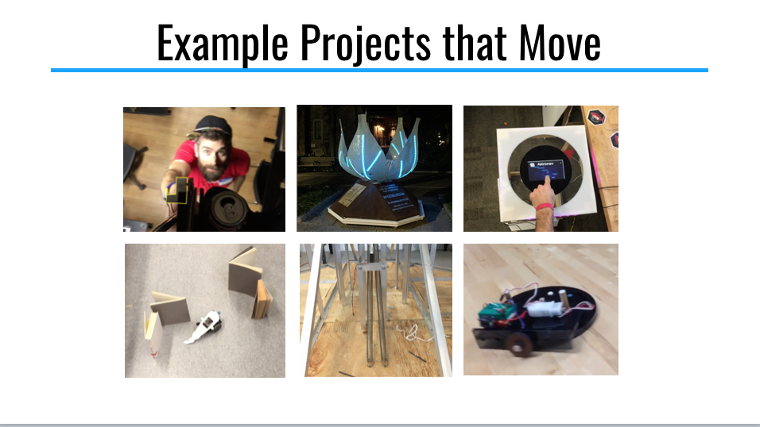
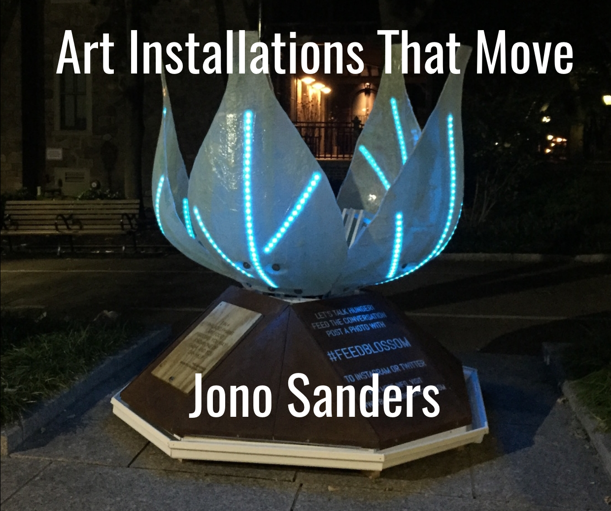

# Art Installations That Move

Workshop on motors in art installations by [@sjono](https://github.com/sjono), held at DeskHub on August 23, 2018.

## Files

* **[Motors in Art](motors%20in%20art.pdf)** (PDF) - presentation slides

* **[servo_test-LIVE.ino](servo_test-LIVE.ino)** - live example using a servo + joystick (arduino code)

## Other Resources 
*Also in the last slide of the presentation*

* [Making Things Move](www.makingthingsmove.com/) - Dustyn Roberts — good book that dives deeper into all the concepts

* Intro to circuits for Artists - “[Skating the Circuit](avant.org/project/skating-the-circuits/)” Taeyoon Choi (NYU)

* Motor Selection - [Sparkfun Article](https://learn.sparkfun.com/tutorials/motors-and-selecting-the-right-one/) — this website has lots of good tutorials!

* [Using a MOSFET to control a DC motor](https://www.oddwires.com/using-a-mosfet-to-control-a-dc-motor/) - article on oddwires.com — includes Arduino code

* How to Solder - [Collin’s Lab Video](https://www.youtube.com/watch?v=QKbJxytERvg) — good video from Adafruit with the basics

